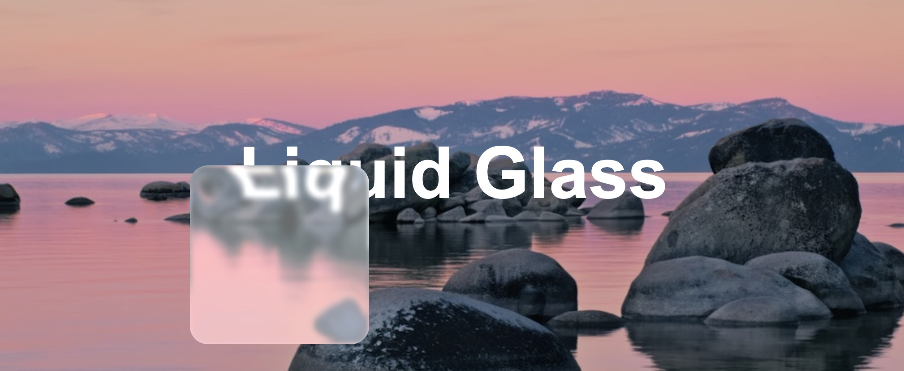

# 🌊 Liquid Glass Effect

A beautiful, standalone glassmorphism effect with liquid distortion and chromatic aberration. This component can be easily integrated into any web application.



## ✨ Features

- **Zero Dependencies**: Pure vanilla JavaScript, no external libraries required
- **Easy to Use**: Simple API for quick integration
- **Customizable**: Full control over appearance with extensive options
- **Responsive**: Auto-resize support for dynamic layouts
- **Performant**: Efficient SVG-based filters with hardware acceleration
- **Modern**: Uses latest web standards (ES modules, ResizeObserver)

## 🚀 Quick Start

### 1. Include the Module

```html
<script type="module">
  import { applyLiquidGlass } from './liquid-glass.js';

  const element = document.querySelector('.my-card');
  applyLiquidGlass(element);
</script>
```

### 2. Basic Usage

```javascript
import { applyLiquidGlass } from './liquid-glass.js';

// Apply default effect
const glassEffect = applyLiquidGlass(document.querySelector('.card'));

// Apply with custom options
const glassEffect = applyLiquidGlass(element, {
  baseColor: 'rgba(100, 200, 255, 0.4)',
  blur: 5,
  strength: 100,
  chromaticAberration: 2,
  autoResize: true,
});
```

## 📖 API Reference

### `applyLiquidGlass(element, options)`

Applies the liquid glass effect to a DOM element.

**Parameters:**

- `element` (HTMLElement, required): The target element
- `options` (Object, optional): Configuration options

**Options:**

| Option                | Type    | Default                      | Description                        |
| --------------------- | ------- | ---------------------------- | ---------------------------------- |
| `radius`              | number  | `10`                         | Border radius in pixels            |
| `depth`               | number  | `8`                          | Glass depth effect (0-20)          |
| `blur`                | number  | `3`                          | Blur amount in pixels (0-10)       |
| `strength`            | number  | `80`                         | Displacement strength (0-200)      |
| `chromaticAberration` | number  | `1`                          | Chromatic aberration amount (0-10) |
| `baseColor`           | string  | `'rgba(255, 255, 255, 0.4)'` | Base glass color                   |
| `autoResize`          | boolean | `false`                      | Auto-update on element resize      |

**Returns:**

An object with the following methods:

- `update(newOptions)`: Update the effect with new options
- `refresh()`: Refresh the effect (useful after manual resize)
- `remove()`: Remove the effect and restore original styles

**Example:**

```javascript
const glassEffect = applyLiquidGlass(element, {
  baseColor: 'rgba(255, 150, 200, 0.4)',
  blur: 4,
  strength: 90,
  autoResize: true,
});

// Later, update the effect
glassEffect.update({ blur: 6, strength: 120 });

// Remove when done
glassEffect.remove();
```

### `LiquidGlass` Class

For managing multiple elements with liquid glass effects.

```javascript
import { LiquidGlass } from './liquid-glass.js';

const lg = new LiquidGlass();

// Apply to elements
lg.apply('.card-1', { baseColor: 'rgba(100, 200, 255, 0.4)' });
lg.apply('.card-2', { strength: 120 });

// Update specific element
lg.update('.card-1', { blur: 10 });

// Remove from specific element
lg.remove('.card-1');

// Remove all effects
lg.removeAll();
```

**Methods:**

- `apply(elementOrSelector, options)`: Apply effect to an element or selector
- `update(elementOrSelector, options)`: Update effect on an element
- `remove(elementOrSelector)`: Remove effect from an element
- `removeAll()`: Remove all effects managed by this instance

### Lower-Level Functions

For advanced use cases:

#### `getLiquidGlassStyles(options)`

Generates CSS properties object for the liquid glass effect.

```javascript
import { getLiquidGlassStyles } from './liquid-glass.js';

const styles = getLiquidGlassStyles({
  width: 300,
  height: 200,
  radius: 15,
  depth: 10,
  blur: 4,
  strength: 100,
  chromaticAberration: 2,
  baseColor: 'rgba(255, 255, 255, 0.5)',
});

// Apply manually
Object.assign(element.style, styles);
```

#### `getDisplacementFilter(options)`

Creates the SVG displacement filter URL.

```javascript
import { getDisplacementFilter } from './liquid-glass.js';

const filterUrl = getDisplacementFilter({
  width: 300,
  height: 200,
  radius: 10,
  depth: 8,
  strength: 80,
  chromaticAberration: 1,
});
```

## 🎨 Usage Examples

### Example 1: Simple Card

```html
<div class="card">
  <h2>Hello World</h2>
  <p>This is a glass card</p>
</div>

<script type="module">
  import { applyLiquidGlass } from './liquid-glass.js';

  applyLiquidGlass(document.querySelector('.card'), {
    autoResize: true,
  });
</script>

<style>
  .card {
    padding: 2rem;
    border-radius: 20px;
    /* The liquid glass effect will be applied on top */
  }
</style>
```

### Example 2: Multiple Cards with Different Colors

```javascript
import { LiquidGlass } from './liquid-glass.js';

const lg = new LiquidGlass();

const colors = [
  'rgba(255, 200, 100, 0.4)', // Orange
  'rgba(100, 200, 255, 0.4)', // Blue
  'rgba(150, 255, 150, 0.4)', // Green
  'rgba(255, 150, 200, 0.4)', // Pink
];

document.querySelectorAll('.card').forEach((card, index) => {
  lg.apply(card, {
    baseColor: colors[index % colors.length],
    autoResize: true,
    strength: 80 + index * 10,
  });
});
```

### Example 3: Dynamic Updates

```javascript
import { applyLiquidGlass } from './liquid-glass.js';

const card = document.querySelector('.card');
const glassEffect = applyLiquidGlass(card, {
  autoResize: true,
});

// Animate the effect
let strength = 80;
let direction = 1;

setInterval(() => {
  strength += direction * 5;
  if (strength >= 150 || strength <= 50) {
    direction *= -1;
  }
  glassEffect.update({ strength });
}, 100);
```

### Example 4: Dark Mode Support

```javascript
import { applyLiquidGlass } from './liquid-glass.js';

const element = document.querySelector('.card');

function applyTheme(isDark) {
  const baseColor = isDark
    ? 'rgba(80, 80, 100, 0.7)' // Dark glass
    : 'rgba(255, 255, 255, 0.4)'; // Light glass

  applyLiquidGlass(element, {
    baseColor,
    autoResize: true,
  });
}

// Apply initial theme
applyTheme(window.matchMedia('(prefers-color-scheme: dark)').matches);

// Listen for theme changes
window
  .matchMedia('(prefers-color-scheme: dark)')
  .addEventListener('change', (e) => applyTheme(e.matches));
```

## 🎮 Interactive Demo

Open `liquid-glass-example.html` in your browser to see an interactive demo with real-time controls for adjusting all parameters.

## 🌈 Color Presets

Here are some beautiful color presets you can use:

```javascript
const colorPresets = {
  // Light mode
  white: 'rgba(255, 255, 255, 0.4)',
  cyan: 'rgba(100, 200, 255, 0.4)',
  rose: 'rgba(255, 150, 200, 0.4)',
  mint: 'rgba(150, 255, 200, 0.4)',
  amber: 'rgba(255, 200, 100, 0.4)',
  lavender: 'rgba(200, 150, 255, 0.4)',

  // Dark mode
  darkGray: 'rgba(60, 60, 80, 0.7)',
  darkBlue: 'rgba(40, 60, 100, 0.7)',
  darkPurple: 'rgba(80, 60, 100, 0.7)',
  darkGreen: 'rgba(40, 80, 60, 0.7)',
};
```

## ⚙️ Browser Support

- Chrome/Edge 88+
- Firefox 85+
- Safari 14+

The effect uses modern web features like:

- CSS `backdrop-filter`
- SVG filters with `feDisplacementMap`
- `ResizeObserver` (for auto-resize)

## 📝 Notes

1. **Performance**: The effect uses SVG filters which are hardware-accelerated. However, applying to many elements simultaneously may impact performance on lower-end devices.

2. **Background**: For the best effect, place elements with liquid glass over colorful or textured backgrounds. The effect works by distorting what's behind the element.

3. **Border Radius**: The `radius` parameter should match your element's CSS border-radius for consistent appearance.

4. **Responsive Design**: Use `autoResize: true` for elements that change size dynamically, or call `refresh()` manually when needed.

## 🤝 Integration Tips

### With React

```jsx
import { useEffect, useRef } from 'react';
import { applyLiquidGlass } from './liquid-glass.js';

function GlassCard({ children, color }) {
  const cardRef = useRef(null);
  const effectRef = useRef(null);

  useEffect(() => {
    if (cardRef.current) {
      effectRef.current = applyLiquidGlass(cardRef.current, {
        baseColor: color,
        autoResize: true,
      });
    }

    return () => {
      effectRef.current?.remove();
    };
  }, []);

  useEffect(() => {
    effectRef.current?.update({ baseColor: color });
  }, [color]);

  return (
    <div ref={cardRef} className="glass-card">
      {children}
    </div>
  );
}
```

### With Vue

```vue
<template>
  <div ref="cardRef" class="glass-card">
    <slot></slot>
  </div>
</template>

<script>
import { ref, onMounted, onUnmounted, watch } from 'vue';
import { applyLiquidGlass } from './liquid-glass.js';

export default {
  props: {
    color: {
      type: String,
      default: 'rgba(255, 255, 255, 0.4)',
    },
  },
  setup(props) {
    const cardRef = ref(null);
    let glassEffect = null;

    onMounted(() => {
      glassEffect = applyLiquidGlass(cardRef.value, {
        baseColor: props.color,
        autoResize: true,
      });
    });

    onUnmounted(() => {
      glassEffect?.remove();
    });

    watch(
      () => props.color,
      (newColor) => {
        glassEffect?.update({ baseColor: newColor });
      },
    );

    return { cardRef };
  },
};
</script>
```

## 📄 License

MIT - Feel free to use in any project!

## 🙏 Credits

Created with ❤️ for beautiful web experiences.
